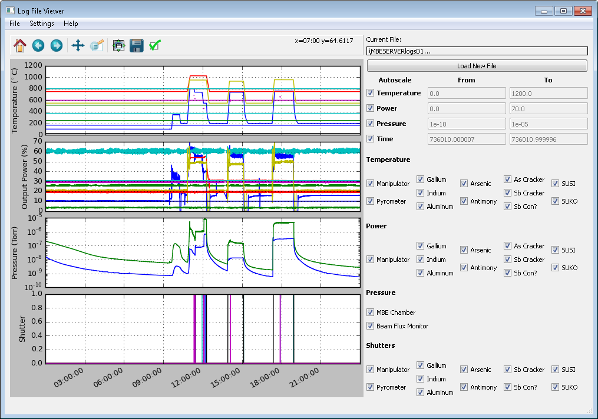

# MBELogFileViewer
Used to intuitively view MBE log files.
 * Allows you to easily open any day's log file
 * Can then navigate the log data intuitively using zoom to box commands
 * Able to also turn on or off various data lines to avoid clutter

# Screenshot

